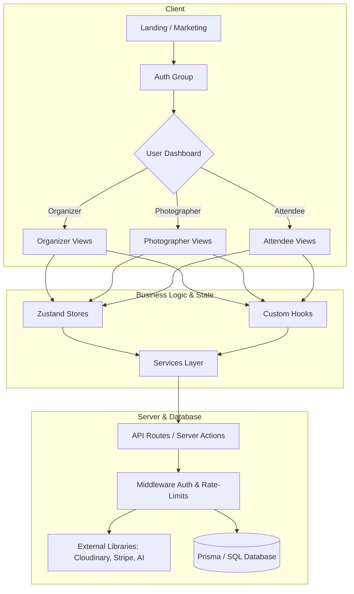

# Spotme — Project Folder Structure

Welcome to the **Spotme** repository. This document outlines the project structure and architectural design for our Next.js event photo platform. It is designed to be highly modular, scalable, and easy to navigate for organizers, photographers, and attendees alike.

---

## 📂 Visual Directory Tree

Here is the exact folder structure established for the platform:

```text
Spotme/
│
├── app/                            # Next.js App Router (pages, layouts, and API routes)
│   ├── (auth)/                     # Auth route group (URL matches directly e.g. /login)
│   │   ├── login/                  # Login page
│   │   ├── register/               # Registration page
│   │   └── forgot-password/        # Password recovery page
│   │
│   ├── (landing)/                  # Marketing site route group
│   │   ├── page.tsx                # Landing page (hero, social proof, call to actions)
│   │   ├── pricing/                # Subscription plans and pricing page
│   │   ├── features/               # Platform details page
│   │   └── about/                  # Company/product info page
│   │
│   ├── dashboard/                  # Unified dashboard router
│   │   ├── organizer/              # Event Organizer view
│   │   │   ├── events/             # Event management, QR creation, and access codes
│   │   │   ├── analytics/          # Sales, attendee reach, and photo downloads
│   │   │   ├── storage/            # Cloud storage allocation and limits
│   │   │   └── settings/           # Organizer account profile
│   │   │
│   │   ├── photographer/           # Photographer portal
│   │   │   ├── uploads/            # Multi-image uploading center
│   │   │   ├── albums/             # Gallery collections & watermarks
│   │   │   └── settings/           # Rates and profile configurations
│   │   │
│   │   ├── attendee/               # Guest / Attendee workspace
│   │   │   ├── gallery/            # General public/event gallery access
│   │   │   ├── matched-photos/     # AI-matched photos (face recognition matches)
│   │   │   └── profile/            # Selfie upload (for AI matching) & ticket details
│   │   │
│   │   └── layout.tsx              # Common dashboard structure (Sidebar, Topbar)
│   │
│   ├── api/                        # Backend REST / Serverless endpoints
│   │   ├── auth/                   # Session verification and social OAuth config
│   │   ├── events/                 # CRUD operations for events
│   │   ├── uploads/                # Signature generation and upload endpoints
│   │   ├── ai/                     # AI face recognition matching requests
│   │   ├── qr/                     # Dynamic QR code generation engine
│   │   └── users/                  # User profile and account management
│   │
│   ├── globals.css                 # Main styling sheet with Tailwind and global styles
│   ├── layout.tsx                  # Root html/body wrapper and global providers
│   └── loading.tsx                 # Site-wide fallback page-load animation
│
├── components/                     # Reusable layout and interface parts
│   ├── ui/                         # Atomic, lower-level UI components (shadcn/radix)
│   │   ├── button.tsx
│   │   ├── card.tsx
│   │   ├── dialog.tsx
│   │   └── input.tsx
│   │
│   ├── landing/                    # UI elements exclusive to marketing pages
│   │   ├── hero.tsx
│   │   ├── features.tsx
│   │   ├── pricing.tsx
│   │   ├── testimonials.tsx
│   │   └── navbar.tsx
│   │
│   ├── dashboard/                  # Core dashboard wrapper modules
│   │   ├── sidebar.tsx             # Collapsible left panel
│   │   ├── topbar.tsx              # Breadcrumbs, search, notification, and profile
│   │   ├── analytics-card.tsx      # Chart / numeric metric display
│   │   └── upload-zone.tsx         # Drag-and-drop media panel
│   │
│   └── shared/                     # Multi-purpose utility components
│       ├── logo.tsx                # Brand vectors
│       ├── loader.tsx              # Inline progress spinners
│       └── empty-state.tsx         # Search / fetch fallback display
│
├── features/                       # Modular business domain logic (Feature-driven design)
│   ├── auth/                       # Signup/signin handlers & OAuth workflows
│   ├── events/                     # Event creation, passcode verification
│   ├── uploads/                    # File chunking & compression mechanics
│   ├── ai-matching/                # Core face indexing and matching pipelines
│   ├── qr-system/                  # PDF/Image QR code exports for tables
│   └── subscriptions/              # Subscription upgrades and Stripe webhook listeners
│
├── lib/                            # Integrations and helper utilities
│   ├── db.ts                       # Prisma Client singleton
│   ├── auth.ts                     # NextAuth configurations
│   ├── uploadthing.ts              # Uploadthing config client
│   ├── cloudinary.ts               # Cloudinary CDN management wrapper
│   ├── stripe.ts                   # Stripe payment methods and SDK settings
│   ├── ai.ts                       # External AI face-recognition SDK initializer
│   └── utils.ts                    # CSS class merging and data formatters
│
├── hooks/                          # Custom React hooks
│   ├── use-mobile.ts               # Detect viewport sizes
│   ├── use-toast.ts                # App notifications
│   └── use-upload.ts               # Handle image upload state and progress
│
├── services/                       # Data fetchers and server-side operations
│   ├── event.service.ts            # Database queries for event models
│   ├── auth.service.ts             # Auth tokens and session handlers
│   ├── upload.service.ts           # Storage signatures and asset databases
│   ├── ai.service.ts               # Vector matching calls
│   └── qr.service.ts               # SVG/Canvas QR generation commands
│
├── store/                          # Zustand client-side state engines
│   ├── auth-store.ts               # Current user session cache
│   ├── event-store.ts              # Active event selection states
│   └── upload-store.ts             # Active upload batch queues
│
├── types/                          # Shared TypeScript types and interfaces
│   ├── event.ts
│   ├── user.ts
│   ├── photo.ts
│   └── api.ts
│
├── prisma/                         # Database schema definition
│   ├── schema.prisma               # Prisma models (User, Event, Photo, Album, etc.)
│   └── migrations/                 # SQL database schema migration logs
│
├── public/                         # Static files accessible directly
│   ├── images/                     # Graphic illustrations
│   ├── icons/                      # Interface vector paths
│   └── logos/                      # Platform emblems
│
├── styles/                         # Dedicated stylesheet modules
│   └── animations.css              # Custom keyframe configurations for transitions
│
├── middleware.ts                   # Next.js router middleware (Auth guard, role checks)
├── next.config.mjs                 # Next.js compiler settings and image domains
├── tailwind.config.ts              # Tailwind CSS utility and style definitions
├── tsconfig.json                   # TypeScript configuration files
├── package.json                    # Dependency listings and app scripts
└── .env                            # Secure credentials (DB keys, Cloudinary tokens, Stripe secret)
```

---

## 🏗️ Core Architectural Flow



---

## ⚡ Next.js Concepts Used In This Structure

1. **Route Groups `(auth)` & `(landing)`**:
   Folders wrapped in parentheses are used to organize files without affecting the URL path.
   * `app/(auth)/login/page.tsx` is served at `/login`.
   * This helps keep code clean and separates public-facing templates from secure portals.

2. **Dashboard Role Division**:
   Instead of fragmented dashboards, all roles are centralized in `app/dashboard/` while sub-scoped dynamically:
   * `/dashboard/organizer` — Create events, generate QR codes, analyze metrics.
   * `/dashboard/photographer` — High-speed uploads and watermarking.
   * `/dashboard/attendee` — Access matched photos via facial recognition query.

3. **Separation of Services vs. Features**:
   * **`features/`** contains core business logic packages (e.g., matching mechanisms, QR generation logic).
   * **`services/`** is dedicated to server-side operations, fetching data from databases, or performing API integrations.
   * **`components/`** focuses solely on rendering the user interface, separating layout from complex computations.
